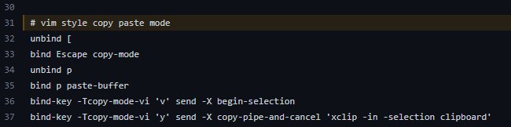
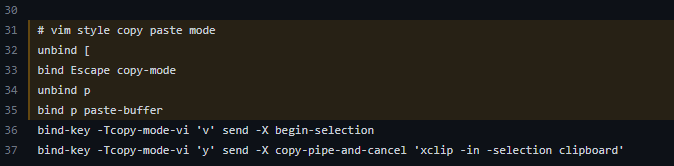
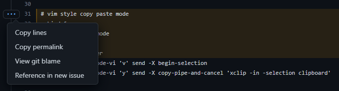

# tools-scripts

This is a scattered collection of things I've found either useful to write down or save. Whether that be simple CLI commands I consistently forget, or config files for applications like Vim and Tmux. This should probably be a private repository, but I don't want to log in to GitHub each time I forget how to unzip a tarball.

## SSH and SCP

### SSH Key Generation

For new systems:
```shell
$ ssh-keygen -t ed25519 -C "your_email@example.com"
```
For older/legacy:
```shell
$ ssh-keygen -t rsa -b 4096 -C "your_email@example.com"
```

### SCP

Copy a directory from remote to local:
```shell
$ scp -r <username>@<remote_ip>:<remote_directory_location> <local_target_location>
```

## Tar files

To compress:

```shell
$ tar -czvf name-of-archive.tar.gz /path/to/directory-or-file
```

To extract:

```shell
$ tar -xzvf archive.tar.gz
```

For reference:

* -c: Create an archive
* -x: Extract an archive
* -z: Compress the archive with gzip
* -v: Verbose
* -f: Specify filename of the archive

## Bash Tricks

Change forward slashes to back slashes. The following will have `D:/test/directory/structure` copied to the clipboard.
```shell
$ echo 'D:\test\directory\structure' | tr '\\' '/' | clip
```

## Shell Scripts

### Prompt to continue
[Taken from here.](https://stackoverflow.com/questions/1885525/how-do-i-prompt-a-user-for-confirmation-in-bash-script) One way:
```shell
read -p "Are you sure? " -n 1 -r
echo    # (optional) move to a new line
if [[ $REPLY =~ ^[Yy]$ ]]
then
    # do dangerous stuff
fi
```
The inverse:
```shell
read -p "Are you sure? " -n 1 -r
echo    # (optional) move to a new line
if [[ ! $REPLY =~ ^[Yy]$ ]]
then
    [[ "$0" = "$BASH_SOURCE" ]] && exit 1 || return 1 # handle exits from shell or function but don't exit interactive shell
fi
# does dangerous stuff (if it gets here)
```

## Get permalink to a line on Github

Don't just link to the line numbers! Be sure to use the [canonical URL](https://docs.github.com/en/repositories/working-with-files/using-files/getting-permanent-links-to-files) too. Otherwise when that file is updated, you'll have a URL that points to the wrong lines!

### How to make a permanent link to the right lines:

Click on the line number you want (like line 31), and the URL in your browser will get a #L31 tacked onto the end. You literally click on the 31 at the left side, not the line of code. Looks like this:



And now your browser's URL looks like this:

```
https://github.com/erjseals/tools-scripts/blob/master/config/.tmux.conf#L31
```

If you want multiple lines selected, simply hold down the Shift key and click a second line number, like line 35. Looks like this:



And now your browser's URL looks like this:

```
https://github.com/erjseals/tools-scripts/blob/master/config/.tmux.conf#L31-35
```

### Here's the important part:

Now get the canonical URL for that particular commit by pressing the `Y` key. The URL in your browser will change to become something like this:

```
https://github.com/erjseals/tools-scripts/blob/725f8bf054ed3b8e3ffd87da639e7fa1dda50044/config/.tmux.conf#L31-L35
```

That link contains the actual [SHA-1](https://en.wikipedia.org/wiki/SHA-1) hash for that particular commit, rather than the current version of the file on `master`. That means that this link will work forever and not point to lines 31-35 of whatever future version of that file might contain.

GitHub has now made it easier to get the permanent link by providing a `...` menu on the left after you select one or more lines.




## Double click *.zip file to "Extract Here" instead of just opening 7zip

[Source](https://sourceforge.net/p/sevenzip/discussion/45797/thread/d8d4d8bccd/)

This assumes that 7zip is set to be the default zip handler. First, open the registry editor and navigate to:

`HKEY_CLASSES_ROOT\7-Zip.zip\shell\open\command`

The current (Default) value should be `"C:\Program Files\7-Zip\7zFM.exe" "%1"`. Double-click on this and copy the string to the clipboard.

Create a new key under `HKEY_CLASSES_ROOT\7-Zip.zip\shell` so that new key is a sibling to "open". The new key can be named something like `extract_to`. Next, create a subkey under `extract_to` and name it `command`. Now double-click on the (Default) string value of this `command` key and paste `"C:\Program Files\7-Zip\7z.exe" x "%1" -o*` (including quotes) and click OK.

Double-click on the (Default) string value of `HKEY_CLASSES_ROOT\7-Zip.zip\shell`, pasting `extract_to` or whatever name you gave the new key in the last step. This string will also appear on the context menu if you right-click a zip.

To get 7zip to do something instead of extracting into a directory, you just need to modify what you paste. [All possible args can be found here](https://info.nrao.edu/computing/guide/file-access-and-archiving/7zip/7z-7za-command-line-guide). For example, the "Extract Here" functionality is set by pasting `"C:\Program Files\7-Zip\7z.exe" x "%1"`.

If you don't want to set this for all users, you can instead make the changes at the user level with `HKEY_CURRENT_USER\SOFTWARE\Classes\7-Zip.zip\shell` which is probably better anyway.

## General Linux Things

### Change default timeout of `sudo`

Type `sudo visudo` in terminal. Look for the following line in the temp file:

`Defaults   env_reset`

Change to the following, where X is the time you want to set in minutes.

`Defaults   env_reset,timestamp_timeout=X`

## Debugging 

### GDB

To use GDB:

```shell
$ gdb ./executablefile -tui
(gdb) r arg1 arg2 arg3
```

* breakpoint (line #)   : b <filename>.c:<linenum>
* breakpoint (mem addr) : b \*0x12345678
* continue : c
* next : n
* print : p <variable>
* show all local : info locals
* run/restart : r
* disable breakpoints : disable
* (In tui) switch through previously used commands : ctrl + p & ctrl + n

### Valgrind

```shell
$ valgrind --leak-check=full --track-origins=yes --verbose
```

## Vim

### Vim netrw

List of useful commands on netrw:

* `R`: Renames a file
* `gh`: Toggles the hidden files
* `I`: Changes display style (Vertical / Horizontal / Tree / ...)

### Latex and Vim (and with plugin VimTex)

At the default, you start compilation processes with "\\ll". From here, :w will recompile the pdf - so use a document viewer that allows for live updates.

### Multiline Edits

1. Press `Ctrl` + `v` to enter into visual block mode.
2. Use `j` or `k` to select multiple lines.
3. Press `Shift` + `i` and start typing what you want.
4. After pressing `Esc`, text will be inserted.

## git

### Rebase up to a specific SHA:

Say you have a history like this:

```
A --- B --- C          master
 \
  \-- D                topic
```
and would like to move towards
```
A --- B --- C          master
       \
        \-- D          topic
```
instead of the following (this would be the result of `git pull --rebase`)
```
A --- B --- C          master
             \
              \-- D    topic
```
This can be done with the following four commands:
```shell
git branch temp master^
git checkout topic
git rebase temp
git branch -d temp
```

### Show all files changed in a commit:
```shell
$ git diff-tree --no-commit-id --name-only HEAD^ -r
Manifest.xml
WindowManager.cpp
WindowManager.hpp
```

### Show what changed in a specific file between two different commits:
```shell
$ git diff HEAD^ HEAD WindowManager.cpp
** git diff here from previous HEAD to current HEAD **
```

### Pull out a change from the most recent commit
Say you accidentally committed a file, here's how to remove that from most recent commit and have it moved to the staging area (so you could add it to a different commit):
```shell
$ git reset HEAD^ -- WindowManager.cpp
```

### Git log
Log, one line per commit, the n number of files which touched a specific line of a specific file (line 42 in this example):
```shell
$ git log --no-patch --pretty=format:"%h %s (%an)" -L 42,42:example.py -n 5
641f31d9ca Summary for a patch that changed line 42 (Eric Seals)
641fasdgfs Summary for a patch that changed line 42 (Eric Seals)
aay546f9ct Summary for a patch that changed line 42 (Eric Seals)
641e7r75pp Summary for a patch that changed line 42 (Eric Seals)
35fghgdrnf Summary for a patch that changed line 42 (Eric Seals)
```
You can also specify a range, so say I wanted to see all changes on lines 42-100:
```shell
$ git log --no-patch --pretty=format:"%h %s (%an)" -L 42,100:example.py -n 5
641f31d9ca Summary for a patch that changed line 42 (Eric Seals)
641fasdgfs Summary for a patch that changed line 57 (Eric Seals)
aay546f9ct Summary for a patch that changed line 96 (Eric Seals)
641e7r75pp Summary for a patch that changed line 47 (Eric Seals)
35fghgdrnf Summary for a patch that changed line 77 (Eric Seals)
```

### Show git diff for the files in the staging area:
```shell
$ git diff --staged
```

### Reset a specific file (for the example file 'my-file.txt'):
```shell
$ git checkout HEAD -- my-file.txt
```

### git [rebase](https://www.atlassian.com/git/tutorials/rewriting-history/git-rebase)

Modifying a specific commit in the history. For example, if you have a simple history like this:

```shell
abcde73f (HEAD -> master) Most recent commit
gh2ijk4l Add changes to README.md
bbc643cd Rename variable
st58uvwx init README.md
```
But you actually renamed the variable incorrectly (in the commit bbc643cd "Rename variable"), and you want to add that fix to *that* specific commit while keeping the history the same (the SHAs will change)... Use rebase! [Here's what you do](https://stackoverflow.com/questions/1186535/how-do-i-modify-a-specific-commit):

```shell
$ git rebase --interactive 'bbc643cd^'
```

Please note the caret ^ at the end of the command, because you need actually to rebase back to the commit before the one you wish to modify.

In the default editor, modify `pick` to `edit` in the line mentioning `bbc643cd`.

Save the file and exit. git will interpret and automatically execute the commands in the file. You will find yourself in the previous situation in which you just had created commit `bbc643cd`.

At this point, `bbc643cd` is your last commit and you can easily amend it. Make your changes and then commit them with the command:

```shell
$ git commit --all --amend --no-edit
```

After that, return back to the previous HEAD commit using:

```shell
$ git rebase --continue
```

**WARNING**: Note that this will change the SHA-1 of that commit **as well as all children** - in other words, this rewrites the history from that point forward. You can break repos doing this if you push using the command `git push --force`. The new history will look something like this (observe the new SHAs):
```shell
yzj4l634 (HEAD -> master) Most recent commit
f9sd0aj4 Add changes to README.md
234l63n6 Rename variable
st58uvwx init README.md
```
### git stash

Say you're doing the above rebase process. You're at the head with some changes you want to apply to a previous patch, but calling `git rebase --interactive '<SHA>^'` is going to say:
```shell
$ git rebase --interactive 'bbc643cd^'
error: cannot rebase: You have unstaged changes.
error: Please commit or stash them.
```
For the most part, git will tell you what to do about changes. For example, your error message said to `git stash` your changes. This would be if you wanted to keep them. After pulling, you would then do `git stash pop` and your changes would be reapplied.

You can also see the list of stashes within the stash by:
```shell
$ git stash list
```
and see the actual files with:
```shell
$ git stash show
```
Instead of popping everything, you can individually checkout a specific file from the stash with:
```shell
$ git checkout stash@{0} -- <filename>
```
### git [cherry-pick](https://git-scm.com/docs/git-cherry-pick)

[Here's how to cherry-pick without pulling in the commit message](https://stackoverflow.com/questions/32333383/git-cherry-pick-to-working-copy-without-commit):

```shell
$ git cherry-pick -n <HASH>
```

To then unstage the staged changes:

```shell
$ git reset
```
## (git) Grep

### Regex with git grep

Documentation for [git grep](https://git-scm.com/docs/git-grep) and specifically the style of regexp being used - that is [PCRE regex syntax](https://www.pcre.org/). Relevant and [useful stackoverflow](https://stackoverflow.com/questions/71144399/how-can-i-use-git-grep-with-regular-expressions).

```shell
$ git grep --recurse-submodules -P 'DBG_[AEIDW]\( [a-zA-Z_ %,?."]+\);'
```

Find DBG logs with elvis operator

```shell
$ git grep --recurse-submodules -P 'DBG_[AEIDW]\([a-zA-Z_" %,.#]+\?[a-zA-Z_" %,.#:]+\);'
```

### Git grep search to include all directories/submodules

```shell
$ git grep -e "bar" --recurse-submodules
```

### Git grep search to include all directories/submodules, but only in .str files

```shell
$ git grep -e "bar" --recurse-submodules '*.str'
```
### Git checkout and update the submodules to where they were pointed by super-repo

```shell
$ git checkout $1; git submodule update --recursive
```

### Git search repo for commits modifying a string

```shell
$ git log -S <whatever> --source --all
```

To find all commits that added or removed the fixed string whatever. The `--all` parameter means to start from every branch and `--source` means to show which of those branches led to finding that commit. It's often useful to add `-p` to show the patches that each of those commits would introduce as well.

You need to put quotes around the search term if it contains spaces or other special characters, for example:

```shell
$ git log -S 'hello world' --source --all
$ git log -S "dude, where's my car?" --source --all
```

## External HDD Read-Only Issue

Try executing the following command in a terminal:

```shell
$ sudo mount -o remount,uid=1000,gid=1000,rw /dev/sdc1
```

Explanation:

* -o means "with these options".
* remount - remounts the drive over the same mount point with the same previous options.
* uid=1000 - this option makes the user with id 1000 the owner of the drive. If you have more than one username on your system, run the command id and use the number after uid=.
* gid=1000 - this option makes the group with id 1000 the group owner of the drive. Same notes as previous point.
* rw - this option mounts the drive as read/write. It was probably read/write anyways, but this is just to double check.
* /dev/sdc1 is the name of the partition or device (can be checked in GParted in case you need to do the same with a different hardisk)

[Credit](https://askubuntu.com/questions/333287/how-to-fix-external-hard-disk-read-only)

## Windows / Linux Time Issue

Force Linux to use local time:

```shell
$ timedatectl set-local-rtc 1 --adjust-system-clock
```

To check current settings, run:

```shell
$ timedatectl
```

If you see “RTC in local TZ: yes”, Linux is set to use the local time zone instead of UTC. The command warns you that this mode is not fully supported and can cause some problems when changing between time zones and with daylight savings time. However, this mode is probably better supported than the UTC option in Windows. If you dual-boot with Windows, Windows will handle daylight savings time for you.

To undo the first command:

```shell
$ timedatectl set-local-rtc 0 --adjust-system-clock
```

## Jetson SDK Manager doesn't like Ubuntu>18

```shell
$ sudo cp /usr/lib/os-release to /usr/lib/os-release-bionic
$ sudo cp /usr/lib/os-release to /usr/lib/os-release-hisure
$ sudo vim /usr/lib/os-release-bionic
```

```
NAME="Ubuntu"
VERSION="18.04.5 LTS (Bionic Beaver)"
ID=ubuntu
ID_LIKE=debian
PRETTY_NAME="Ubuntu 18.04.5 LTS"
VERSION_ID="18.04"
HOME_URL="https://www.ubuntu.com/"
SUPPORT_URL="https://help.ubuntu.com/"
BUG_REPORT_URL="https://bugs.launchpad.net/ubuntu/"
PRIVACY_POLICY_URL="https://www.ubuntu.com/legal/terms-and-policies/privacy-policy"
VERSION_CODENAME=bionic
UBUNTU_CODENAME=bionic
```

When you want to start sdkmanager:

```shell
$ sudo cp  /usr/lib/os-release-bionic /usr/lib/os-release
$ sdkmanager
```

When you are done:
```shell
$ sudo cp /usr/lib/os-release-hisure /usr/lib/os-release
```

## Download videos from Blackboard

* load the page containing the video; don't click anything yet, and wait for everything to load
* Right-click anywhere, and select "Inspect" or "Inspect Element" (Chrome/Firefox respectively). A large panel will come up; select the "Network" tab.
* Click once on the video to load it, and then another time to start playing it. Click pause after the video starts playing.
* The "Network" tab will fill up with a list of files. You want the last one called "index.m3u8". Right-click it; under "Copy", select "Copy link address" or "Copy URL" (Chrome/Firefox respectively)
* Download and run VLC. In the "Media" menu, click "Convert" (or "Convert / Save", depending on your version). Paste the URL you've copied into the URL text field. Depending on your VLC version, this might be under the "Network" tab, or it might be right there as the "Source" text field.
* Pick where to save your video under "Destination".
* Click "Start" to start the download, after which the lecture will be available as a video on your computer.
